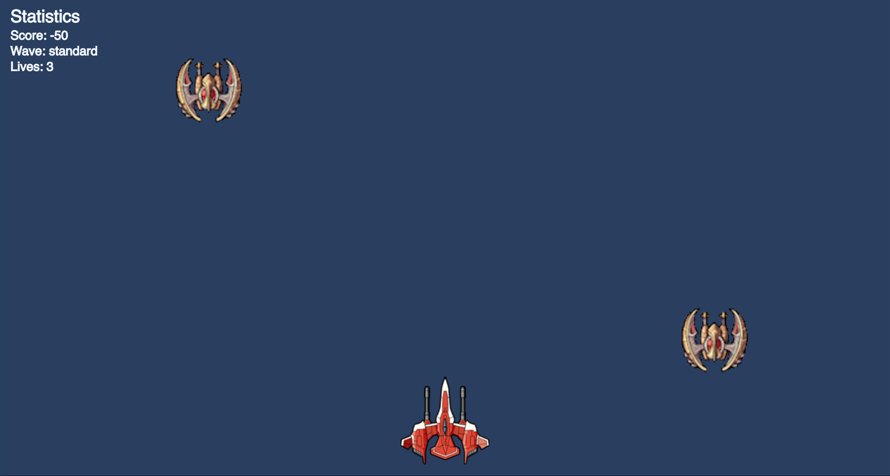

# GameJamFall2018

This is the Git Repo that we used to construct our game for the Fall-2018 edition of GameJam!  This game is constructed inside of an html file using the P5.js and P5.play javascript libraries.  It is a space-invaders style shooter with an **epic** boss battle after you reach a certian score.  Beware of the Whale!

## Preview

## Authors

- [Matt Peachey](https://web.cs.dal.ca/~peachey)
- [James MacPhee](https://web.cs.dal.ca/~macphee)

---

Libraries used in this project:
* [P5.js](https://p5js.org/)
* [P5.play](http://p5play.molleindustria.org/)
